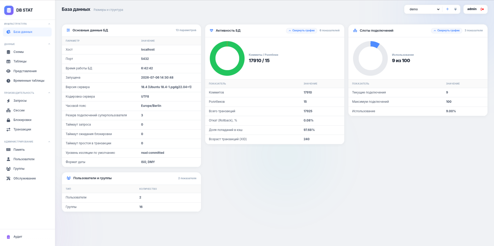
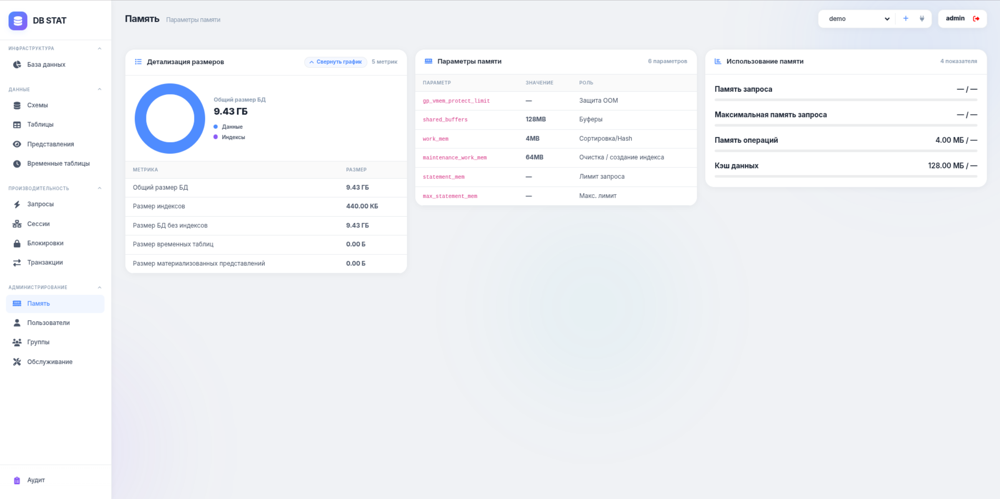
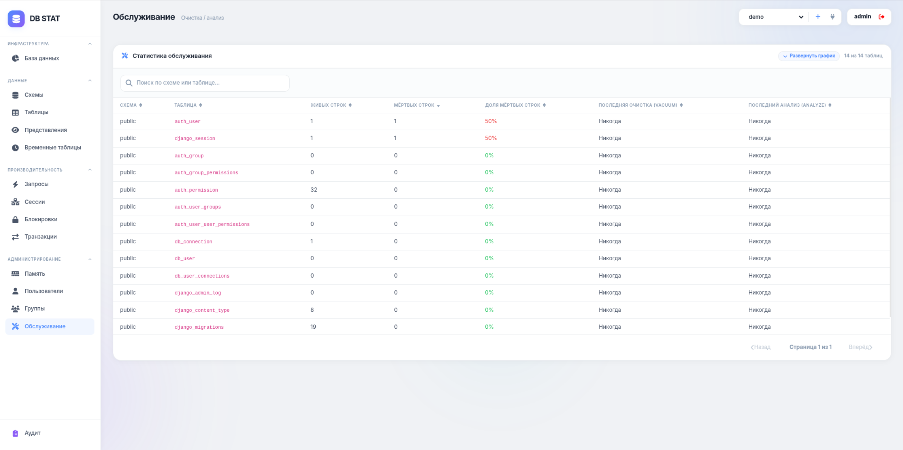
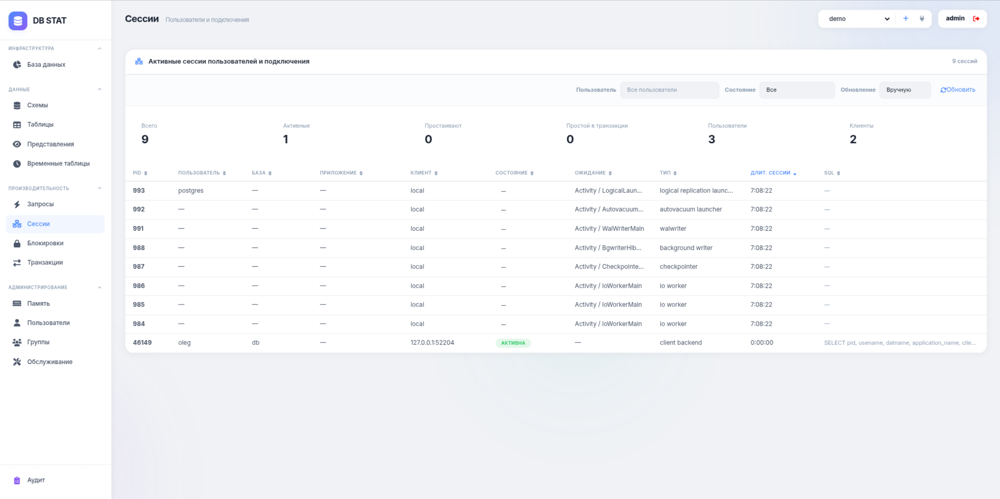

#   DB STAT

**Русский** | [English](README.en.md)

## Описание проекта

```
Веб-приложение для мониторинга и диагностики баз данных PostgreSQL/Greenplum.
Проект помогает оценивать состояние подключённых баз данных через единый интерфейс.
Приложение позволяет проводить мониторинг БД.
Основная цель DB STAT - упростить ежедневный контроль состояния БД.
```

## Демо проекта

[](https://youtu.be/9NN8SoxMOZA)

## Скриншоты проекта

<table>
  <tr>
    <td></td>
    <td></td>
  </tr>
  <tr>
    <td></td>
    <td></td>
  </tr>
</table>

## Настройка окружения

- Версия Python 3.12

- Файл .env

```
SECRET_KEY=
DEBUG=True
ALLOWED_HOSTS=*
CSRF_TRUSTED_ORIGINS=http://localhost:8000,http://127.0.0.1:8000
TIME_ZONE=Europe/Minsk
LANGUAGE_CODE=ru

DB_CONNECTION_ENCRYPTION_KEY=

DB_ENGINE=sqlite
SQLITE_NAME=db.sqlite3

DB_NAME=db_statistics
DB_USER=postgres
DB_PASSWORD=postgres
DB_HOST=localhost
DB_PORT=5432

STATIC_URL=static/
```

## Запуск проекта в режиме разаработки

- Установка библиотек из файла requirements.txt

```bash
pip install -r requirements.txt
```

- Создание и применение миграций

```bash
python manage.py makemigrations
python manage.py migrate
```

- Создание суперпользователя для входа в Django Admin

```bash
python manage.py shell -c "from django.contrib.auth import get_user_model; User=get_user_model(); User.objects.filter(username='admin').exists() or User.objects.create_superuser('admin', 'admin@example.com', 'admin')"
```

- Создание пользователя DBUser для авторизации в приложении

```bash
python manage.py shell -c "from db_statistics.models import DBUser; DBUser.objects.filter(login='admin').exists() or DBUser.objects.create(login='admin', email='admin@example.com', role='Администратор', is_active=True)"
```

- Запуск сервера

```bash
python manage.py runserver
```

- Проверка и автоисправление кода

```bash
python -m ruff check .
python -m ruff check . --fix
python -m ruff format .
```

## Запуск проекта в Docker

- Сборка Docker-образа

```bash
docker build -t db-stat .
```

- Запуск Docker-контейнера

Запуск контейнерка с доступом к локальной БД.

```bash
docker run --rm --network=host db-stat
```

Запуск контейнерка без доступа к локальной БД.

```bash
docker run --rm -p 8000:8000 db-stat
```

```
Доступно по адресу: http://localhost:8000
Суперпользователь Django Admin:
- логин: admin
- пароль: admin
Пользователь приложения:
- логин: admin
- почта: admin@example.com

Если после сборки есть ошибка подключения к `172.17.0.1` или `192.168.0.1`, значит запущен старый Docker-образ. 
Пересоберите образ и запустите контейнер заново.
```


## Скачать образ из hub.docker

https://hub.docker.com/r/olegegoism/db-stat
